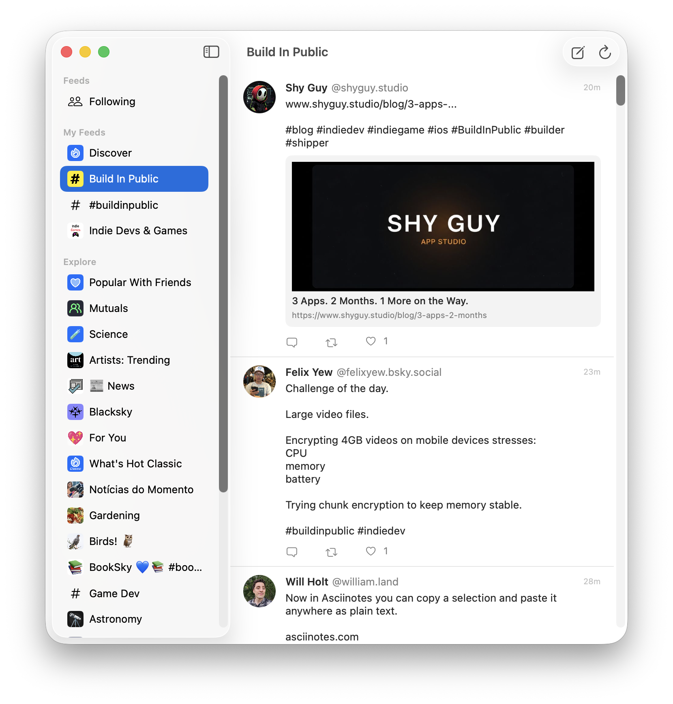

# Ciel

A native macOS client for [Bluesky](https://bsky.social), built with SwiftUI and [ATProtoKit](https://github.com/MasterJ93/ATProtoKit).

## Features

- **Timeline & Custom Feeds** — Browse your Following timeline or any of your saved feeds from the sidebar
- **Post Composition** — Write new posts with image attachments and alt text
- **Replies, Likes, Reposts** — Interact with posts directly from the timeline
- **Session Persistence** — Credentials stored in Keychain; sessions restore automatically on launch
- **Native macOS UI** — NavigationSplitView, keyboard shortcuts.

## Installation

### Download

Grab the latest `.dmg` from the [Releases](https://github.com/poitch/Ciel/releases) page.

### Build from Source

Requires macOS 14 Sonoma and Xcode 16 or later.

1. Clone the repository
2. Open `Ciel.xcodeproj` in Xcode
3. Build and run (`⌘R`)

Swift Package Manager will automatically resolve the ATProtoKit dependency.

## Sign In

Ciel uses [App Passwords](https://bsky.app/settings/app-passwords) for authentication. Generate one from your Bluesky account settings and use it to sign in.

## License

MIT
